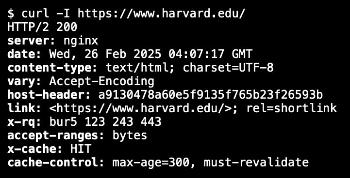

# Week 8: HTML, CSS, JavaScript #

- Routers: Computers/servers whos purpose is the "route" information from one location to another.

- TCP/IP: The set of rules that let computers talk to eachother over the internet.
    1. IP: Internet Protocol
        - IPv4: #.#.#.# 
            - \# -> integer 0 to 255
        - IP v6
    2. TCP: Tranmission Control Protocol
        - Makes sure data is sent and recieved correctly.
        - Sequence Number:
        - Acknowledgement Number:
        - Ports: A unique numeric identity for a internet service.
            - Specify the specific server for the data to be sent. 

- DNS: Domain Name System Servers
    - Translates domain names to IP addresses.
    - "Fully Qualified Domain Name" like google.com or www.google.com match to a registered IP address. 

- DHCP: Dynamic Host Configuration Protocol
    - Give the computer and IP address when it boots up. 
    - IP addresses expire after some inactivty within your device. DHCP assigns and IP address to a device.
    - Tell the computer what DNS servers to use.
    - Tell the computer the "default gateway" (router) to use.

- HTTP: Hypertext Transfer Protocol

- HTTPS: Hypertext Transfer Protocol Secure

- URL: Uniform Resource Locators
    - Example:
    `https://www.example.com/path?key=value&key=value`-> key=values are http parameters
    `https://www.example.com/folder/file.html` -> Secure connections to the Fully Qualified Domain Name `www.example.com` with a path to a `folder` that contains a `file` called `file.html`
        - `.com`-> Top Level Domain (TLD) can represent the type of page or site. Can even represent country/location.
    

- Status Codes:
    - 200 OK
    - 301 Moved Permanently
    - 302 Found
    - 304 Not Modified
    - 307 Temporary Redirect
    - 401 Unauthorized
    - 403 Forbidden
    - 404 Not Found
    - 418 I'm a Teapot
    - 500 Internal Server Error
    - 503 Service Unavailable

- HTML: Hypertext Markup Language

- Regular Expressions: Regulate patterns to limit user input to a specific sequence. 
    1. `.` -> any char
    2. `*` char zero or more times
    3. `+` one or more characters
    4. `?` 0 or 1 character
    5. `{n}` n occurances
    6. `{n,m}` at least n occurences, at most m occurrences
    7. `[0123456789]` any one of the enclosed characters
    8. `[0-9]` any one of the range of characters
    9. `\d` any digit
    10. `\D` any non-digit character

- CSS: Cascading Style Sheets
    - Customize the individual HTML tags.
- Properties: Sets of key, value pairs that allow you to set the value of certain style/artistic element. 
    1. Type Selector: Defining a style for a HTML type as a whole. All HTML elements of this type will have these effects.
        - Example:
        ```
        body
        {
            font-size: 12px
            color: blue;
        }
        ```
    2. Class Selector: An overarching style that is applied to many HTML elements, to limit redundancy in code.
        - Used `.` to label or define a class name.
        - Example:
        ```
        .class
        {
            font-size: 12px
            color: red;
        }
        ```
    3. ID Selectors: A unique, one-off, label to specify an individualistic style to single HTML element. 
        - Use `#` to label or define a ID. 
        - Example:
        ```
        #example-id
        {
            font-size: 12px
            color: red;
        }
        ```
    4. Attribute
     
- Classes: Keywords the can be invented and be reference when styling. Nicknames. 

- Framework: ​​A framework is a collection of pre-written code and tools that provides a structured foundation for developers to build applications, eliminating the need to create basic functionality from scratch. - Jacob Allen
    - Bootstrap: A popular open-source front-end framework for developing responsive and mobile-first websites. It provides a collection of pre-designed HTML, CSS, and JavaScript components, such as grids, buttons, forms, and navigation bars, to streamline web development.

- JavaScript

    - Conditionals:
    if (x < y)
    {

    }
    else if (x > y)
    {

    }
    else
    {

    }

    - Variables:
    `let counter = 0;`
    `counter = count + 1` or `count += 1` or `counter++`

    - Loops:
    ```
    for (let i = 0; i < 3; i++)
    {

    }
    ```
    ```
    while (true)
    {
        
    }
    ```

    - Insert JavaScript into HTML
    `<script src="scripts.js"></script>`

    - Event Driven in the Context of Browsers
        - Events that happen inside a browser that JS can *listen* for. 
    - Events in JS:
    1. blur
    2. change
    3. click
    4. drag
    5. focus
    6. keyup
    7. load
    8. mousedown
    9. moveover
    10. submit
    11. touchmove
    12. unload
